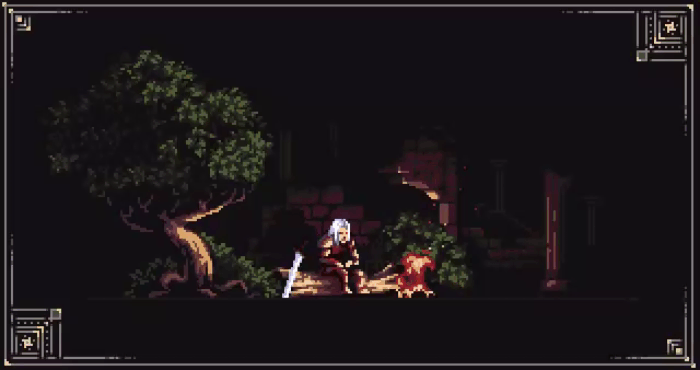

<h1 align="center"> </h1>

  

---
🎯 **Buscando oportunidade de estágio em Desenvolvimento de Software** (Front-end / Full-stack)

## 📫 Contato

---

---

## 👾 Sobre mim

- 🎓 Cursando **Análise e Desenvolvimento de Sistemas** (2º semestre) na **Universidade de Sorocaba | UNISO**
- 🌱 Estudando atualmente: **Banco de Dados**, **Inteligência Artificial** e **Power BI**

---

  

 

## 🩸 Project: DoeFácil

Plataforma digital para incentivo à doação de sangue e geolocalização de hemocentros em tempo real.

- **Papel:** Product Owner (P.O.) e Desenvolvedora Front-end
- 🔗 **Deploy no ar:** [doefacil-ecru.vercel.app](https://doefacil-ecru.vercel.app)
- 📁 **Código no GitHub:** [github.com/biason87/doefacil](https://github.com/biason87/doefacil)

 

  

